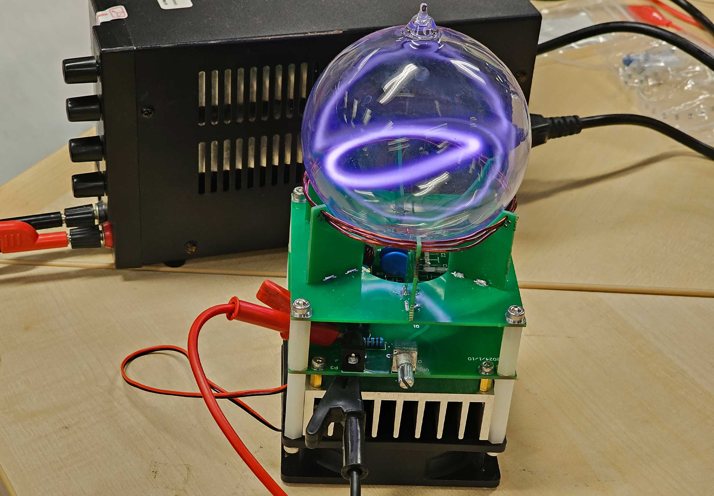
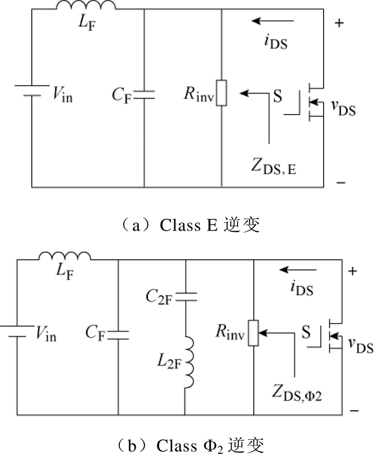
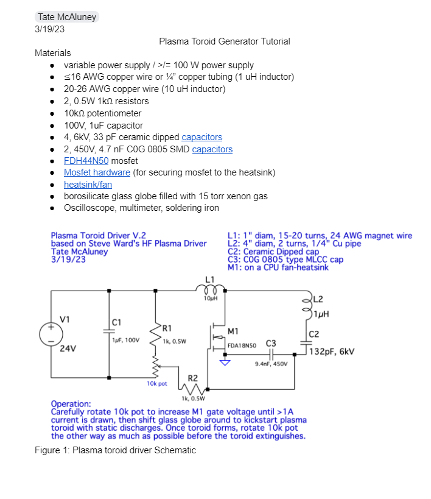
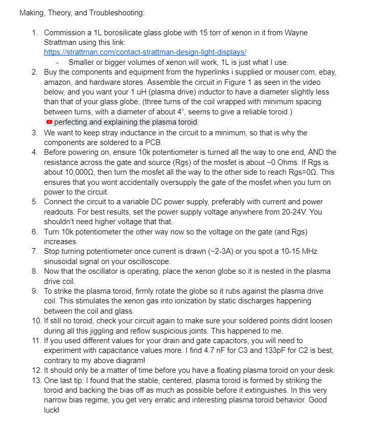
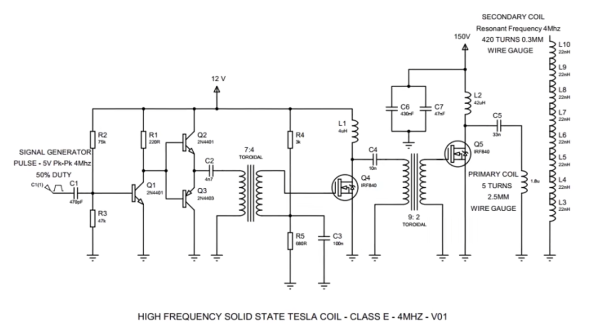

# 等离子球开发记录

起因：在老乡群聊天发现了这个好玩的玩意，找到了类似的实现方案，在此记录一下过程与思路。

## 辉光放电的基本原理

- 辉光放电的基本原理是气体中的电子在电场的作用下获得能量，当这些电子获得足够的能量时，它们会与气体原子或分子碰撞，导致电子被激发到更高的能级。当这些激发的电子返回到它们的基态时，会释放出能量，通常以光的形式。这些光的波长取决于气体的种类和电子跃迁的能级差。

## 辉光放电的类型

辉光放电可以根据其特性和应用被分为几种类型：

- 正常辉光放电：这是最基本的辉光放电形式，通常发生在低气压下。在这个阶段，电流通过气体产生辉光，但放电区域相对稳定。

- 异常辉光放电：当电流进一步增加，气体中的电子密度也会增加，导致更多的碰撞和能量损失，放电区域开始变得不稳定，形成许多小的放电通道。

- 弧光放电：当电流继续增加，放电区域会形成一个明亮的、连续的光弧，这是由于电子温度的增加和气体的进一步电离。

- 射频放电：在射频电场下，气体中的电子会经历快速的加速和减速过程，导致气体电离并产生辉光。这种放电通常用于等离子体源和等离子体刻蚀工艺。

## 辉光放电的应用

辉光放电在许多领域都有应用，包括：

- 科学研究：用于研究气体放电物理、等离子体特性和光谱分析。
- 工业应用：在半导体制造中用于等离子体刻蚀和沉积，以及在表面处理中用于清洗和涂层。
- 照明：霓虹灯和气体放电灯就是辉光放电的应用实例。
- 医疗：等离子体医学中，辉光放电被用于杀菌和治疗某些疾病。

**我们的应用方式就是正常的辉光放电，但是我们使用一个环形的高频交流电来进行激发，所以激发的辉光也是环形的，看上去就像一个等离子环。**

等离子环（Plasma Ring）是一种特殊的等离子体形态，它是由等离子体构成的环形结构。等离子体是物质的第四态，除了固态、液态和气态之外，由带电粒子（正离子和电子）组成的高能状态。等离子环的形成和存在通常与电磁场的特定配置有关，这些配置能够维持和稳定环状的等离子体结构。

## 形成机制

等离子环的形成通常涉及以下几个步骤：

- 产生等离子体：首先，通过高能粒子束、射频放电、激光或其他方式将气体电离，产生等离子体。
- 电磁场配置：通过外部磁场或电场的作用，等离子体被引导和塑形成环形。例如，磁场可以用于约束和稳定等离子体，防止它与周围的真空或物质接触。
- 稳定化：为了维持等离子环的稳定，可能需要精细调节电磁场的强度和方向。在某些情况下，还需要引入额外的机制来抵消不稳定性，如使用射频波或中性束注入。

## 应用领域

等离子环在科学研究和工业应用中有着重要的作用，以下是一些主要的应用领域：

- 聚变研究：在聚变反应研究中，等离子环是实现高温高压等离子体约束的关键结构。托卡马克（Tokamak）和斯特勒林环（Stellarator）是两种常见的聚变实验装置，它们都利用了等离子环的概念。
- 等离子体推进：在航天领域，等离子环可以用于等离子体推进系统，这种系统通过加速和喷射等离子体来产生推力。
- 等离子体医学：等离子环也可以用于医疗领域，例如在消毒和治疗过程中产生特定波长的光。
- 材料加工：在材料科学中，等离子环可以用于薄膜沉积、表面改性和刻蚀等工艺。
- 娱乐和艺术：等离子环因其独特的视觉效果，也被用于娱乐和艺术装置，如等离子体球和等离子体灯。

**我研究这个玩意的目的就是因为帅，所以《玩》，毕竟核聚变的核心技术之一就是环形磁约束，在此的应用领域就是娱乐与艺术。如果到了这里你还看不懂的话，可以看下下面的原理介绍视频**

视频介绍：[作死物理联动】人造天使光圈，“等离子环发生器”是什么原理？其实中学就学过！(中文字幕）](https://www.bilibili.com/video/BV1Cw4m1f7oA/)

## 电路部分

根据原理我们需要产生一个高频变化的电场，因此与高频相关的电路就是基本思路了。
网络上的方案有用E类功放做的高频振荡电路，大概如下：

在油管上找到了原作者的笔记记录，大致如下：

还有的方案做了个特斯拉装置，除去了次级感应线圈，取而代之的是THE BALL。
